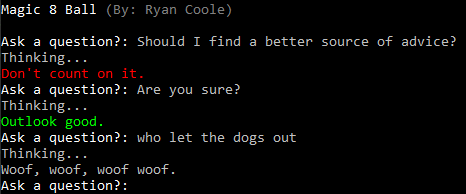

# Magic 8 Ball

A Magic 8 Ball console program created in C#.

# What I Learnt

- Creating a random number to determine response
- Using sleep to make the computer look like its thinking
- Five answers if user types specific question
